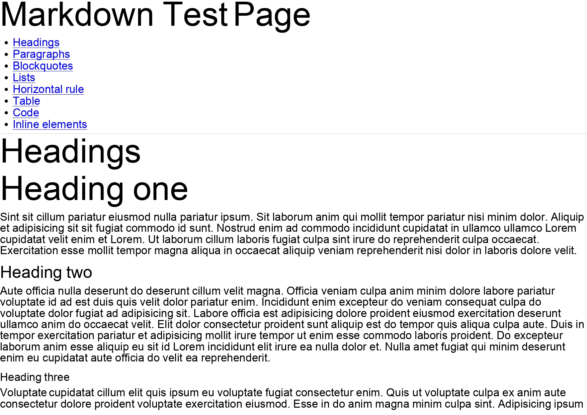

# jsPDF-MD - Markdown plugin for jsPDF

**Generate Markdown pages with JavaScript**

This jsPDF plugin adds the ability to render Markdown by using jsPDF functions and not using any HTML. So there's no dependency to **Puppeteer or any headless browser**.



## Installation

```sh
npm i -S jspdf @ezpaarse-project/jspdf-md
```

## Usage

Checkout examples in [example folder](./example/).

### Using the method provided in jsPDF document

```js
import jsPDF from 'jspdf';
import '@ezpaarse-project/jspdf-md';

const doc = new jsPDF({
  unit: 'px', // Currently not supporting other units
  hotfixes: ['px_scaling'], // Needed if unit is "px", see https://github.com/parallax/jsPDF/blob/master/HOTFIX_README.md#px_scaling
});

doc.mdToPDF('# Hello world !')
  .then(() => doc.save('markdown.pdf'));

// Or use returned value :

doc.mdToPDF('# Hello world !')
  .then((pdf) => pdf.save('markdown.pdf'));
```

### Using the function

```js
import jsPDF from 'jspdf';
import mdToPDF from '@ezpaarse-project/jspdf-md';

const doc = new jsPDF({
  unit: 'px', // Currently not supporting other units
  hotfixes: ['px_scaling'], // Needed if unit is "px", see https://github.com/parallax/jsPDF/blob/master/HOTFIX_README.md#px_scaling
});

mdToPDF(
  doc,
  '# Hello world !',
).then(() => doc.save('markdown.pdf'));
```

### Using directly the parser

```js
import jsPDF from 'jspdf';
import { Parser } from '@ezpaarse-project/jspdf-md';

const remoteRequestor = async (url, method) => {
  const request = await fetch(url, { method });

  return {
    data: await request.arrayBuffer(),
    headers: Object.fromEntries(request.headers.entries()),
  };
};

const pdfDoc = new jsPDF({
  unit: 'px', // Currently not supporting other units
  hotfixes: ['px_scaling'], // Needed if unit is "px", see https://github.com/parallax/jsPDF/blob/master/HOTFIX_README.md#px_scaling
});

// Parse Markdown
const parser = new Parser(md);
parser.parse()
  // Load images found during parse
  .then((mdDoc) => pdfDoc.loadImages(remoteRequestor, 'assetsDir'))
  // Render into PDF
  .then(() => {
    mdDoc.render(pdfDoc);

    pdf.save('markdown.pdf')
  })
```

## Options

Below is a list of all options supported in the plugin

### Render options

These options are common to all the usages and are **all optional**.

- `pageBreak: boolean` - Should create a new page if an element is overflowing
- `codeFont: string` - Font used when rendering a code element. By default it's `Monospace` (included in the lib)

### Plugin options

These options **aren't available when using directly the parser**, but these are **all optional**.

- `remoteRequestor: (...args) => object` - The function used to fetch images
  - Parameters:
    - `url: args[0].string` - The url of the ressource
    - `method: args[0].string` - The method used to get the ressource
  - Returns: `response: object`
    - `response.data: ArrayBuffer` - The data of the ressource
    - `response.headers: Record<string, string>` - Headers of the response
- `margin: number | MarginOption` - Margin between markdown and limit of page. If a number is provided, it's apply to all directions
  - `MarginOption`: `{ top?: number, left?: number, bottom?: number, right?: number}`

## Contributions

Contributions are always welcome, especially on open issues. If you have something major you want to add or change, please post an issue about it first to discuss it further. The workflow for contributing would be something like this:

- Start watcher with `npm run dev`
- Make code changes
- Make sure all examples works
- Commit and submit pull request

**If you don't use [ESLint](https://marketplace.visualstudio.com/items?itemName=dbaeumer.vscode-eslint) auto-fix on save, please run `npm run lint` before opening your PR**
